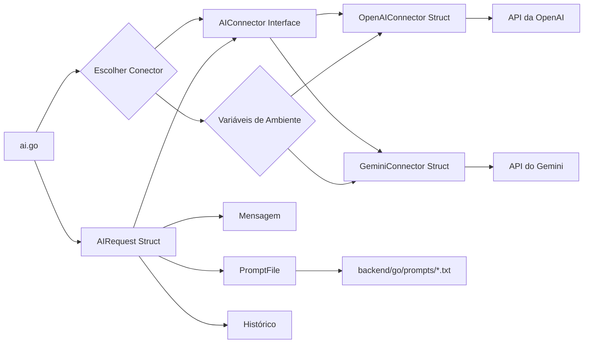

# Plano de Implementação de Conectores de IA

Este documento descreve o plano para implementar um sistema de conectores para facilitar a integração de diferentes APIs de IA no projeto.

## 1. Visão Geral

O objetivo é criar uma arquitetura flexível que permita a fácil adição e configuração de diferentes provedores de IA, como OpenAI e Gemini.

## 2. Componentes Principais

*   **AIRequest Struct:**
    *   Encapsula a mensagem, o pré-prompt e o histórico da conversa.
    *   Campos:
        *   `Message string`: A mensagem a ser enviada para a IA.
        *   `PrePrompt string`: O pré-prompt para configurar a personalidade da IA.
        *   `History []string`: O histórico da conversa.
        *   `PromptFile string`: O nome do arquivo `.txt` contendo o pré-prompt (localizado em `backend/go/prompts`).
*   **AIConnector Interface:**
    *   Define o método `GenerateResponse(request AIRequest) (string, error)`.
*   **OpenAIConnector Struct:**
    *   Implementa a interface `AIConnector` para interagir com a API da OpenAI.
*   **GeminiConnector Struct:**
    *   Implementa a interface `AIConnector` para interagir com a API do Gemini.
*   **Pasta `backend/go/prompts`:**
    *   Armazena arquivos `.txt` contendo pré-prompts específicos.
*   **Função de Escolha de Conector:**
    *   Determina qual conector usar com base em variáveis de ambiente ou outros critérios.

## 3. Fluxo de Dados



## 4. Passos de Implementação

1.  **Criar a pasta `prompts`:** Criar a pasta `backend/go/prompts` para armazenar os arquivos de pré-prompts.
2.  **Criar arquivos `.txt` para os pré-prompts:** Criar arquivos `.txt` dentro da pasta `prompts`, cada um contendo um pré-prompt específico.
3.  **Definir a struct `AIRequest`:**
    ```go
    type AIRequest struct {
        Message   string
        PrePrompt string
        History   []string
        PromptFile string
    }
    ```
4.  **Definir a interface `AIConnector`:**
    ```go
    type AIConnector interface {
        GenerateResponse(request AIRequest) (string, error)
    }
    ```
5.  **Criar structs para cada conector:** Criar structs para os conectores da OpenAI e do Gemini, que implementarão a interface `AIConnector`.
6.  **Implementar a lógica de cada conector:** Cada struct conterá a lógica específica para interagir com a respectiva API de IA. Isso inclui a autenticação, formatação de requisições e tratamento de respostas.
7.  **Modificar o `ai.go` para usar os conectores:** O `ai.go` será modificado para receber um `AIConnector` como parâmetro e usá-lo para gerar as respostas.
8.  **Criar uma função para escolher o conector:** Uma função será criada para determinar qual conector usar com base em uma variável de ambiente ou outro critério.
9.  **Configurar as variáveis de ambiente:** As chaves das APIs da OpenAI e do Gemini serão armazenadas em variáveis de ambiente.
10. **Criar uma função para ler os arquivos de pré-prompt:** Criar uma função utilitária para ler o conteúdo dos arquivos `.txt` na pasta `prompts`.

## 5. Considerações Adicionais

*   Tratamento de erros e logs.
*   Testes unitários e de integração.
*   Documentação detalhada de cada componente.